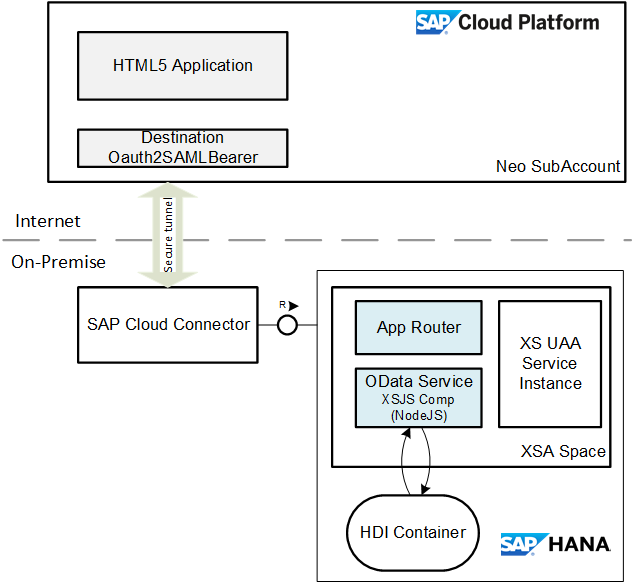
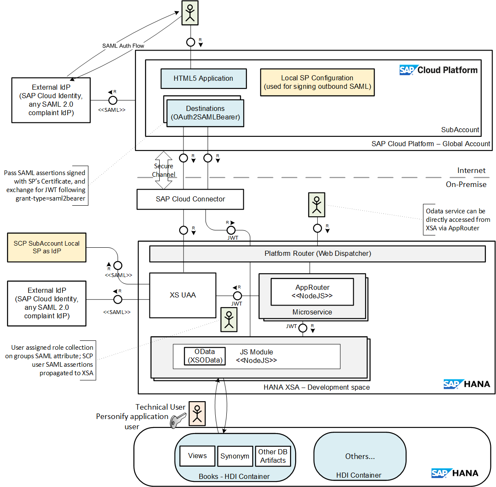
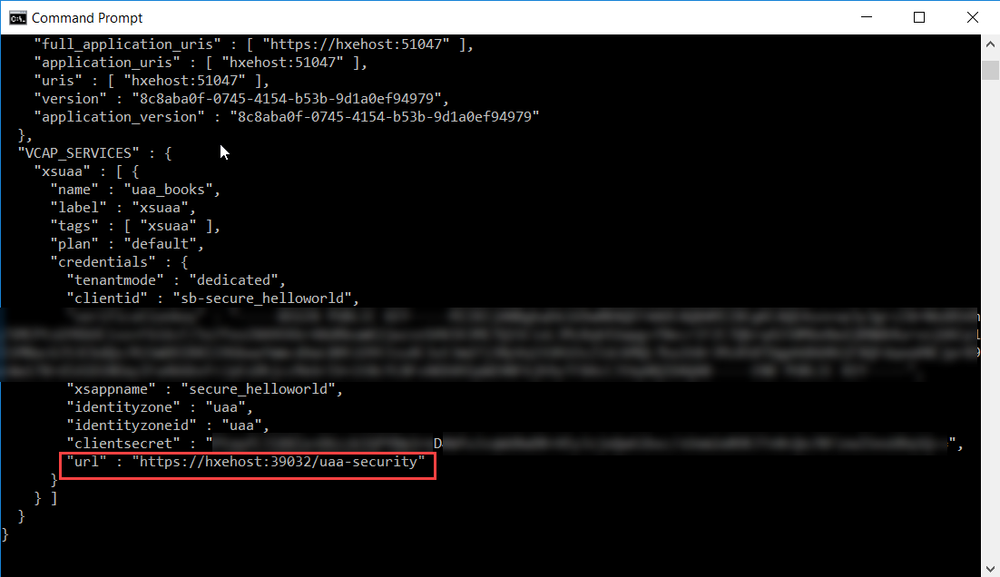

# Consuming an odata service on XSA from an UI5 application in Cloud Platform

Recently, I came across a situation where I had to consume an odata service that's deployed in HANA 2.0 on-premise following XSA paradigm in an UI5 application running in SAP Cloud Platform - Neo environment. 

In this blog, I'd like to take through the concepts and the various configuration steps that are involved in setting up communcaiton channel between an application deployed in SCP to and HANA XSA on-premise. I'll also describe in detial the security configuration to allow an user logged in SCP to access a protected resource in HANA XSA, for example an odata service that requires a specific scope to access. 



Assumption: I assume that you have setup your XSA environment with an external IdP. And that you are familiar with using Application Role Builder, Role Collection and assinging Role Collection to user from XSA Admin Cockpit. 

I'll use a simple applicaiton to demonstrate the steps throught this document. The source code is available at https://github.com/jamal90/xsa_helloworld. 

A quick brief of this application: 
 - The application is an MTA with db, js and approuter module. 
 - The db module defines a simple table, and also a calcuation view on top of this table. The calcuation view "BooksByCountry" has row-level authorization check to only return rows that matches the logged in user country. (Instnace Based Authorization)
 - The js module (xsjs compatibility - nodejs runtime) provides an odata service exposing the calcuation view as an entity. The OData service also requires that user has the scope "books.read" to access the service. (Functional Authorization)
 - The approuter module is basic, and defines the routes in the xs-app.json along with the scopes required. As you know, this acts as the single entry point for the application, and also takes care of user authentication and authorization (partly, since the backend (js module) also needs to check the user has relevant scopes), and forwarding and caching of the JWT for the logged in user. 

Note: We know that XSA by itself can host the UI part of the application as a module in the MTA. In this blog, I'm keeping the UI applicaiton on the cloud (SCP Neo) based on our requirments. 

## Communication Channel Overview 

Before going through the configuration steps, let me quickly go through the concepts of how the entire communication channel works and how the logged user in SCP is authenticated on XS UAA side to access the services taking care of both functional (scopes) and instance based authorizations (analytical privilegs on calcuation level providing row-level permissions)

The application user is authenicated when accessing the UI5 application in the SCP subaccount. The SCP subaccount is configured with an external IdP, that will authenticate the user. The application will access the service on the backend (XSA) via Cloud Connector and the destinations created. The steps that are involved in passing the user context from the SCP HTML5 application to the XSA services in the backend is as follows

1. The user logs in to the HTML5 application authenticated by the external IdP. 

2. When accessing any protected service exposed from XSA on-premise, the backend service should be called with the JWT (JSON Web Token) that the backend service can use to verify that the user is authenticated and has the required authorizations

3. The SCP desitnation configured of type "OAuth2SAMLBearerAssertion" using the configured Token Service URL exchanges the SAML bearer assertion for the JWT token. To explain the steps in detail

    3.1. The SAML attribute statement is created from the Principal attributes that's assinged for this trust configuration (TODO: See fig - YYY). This is done in SCP Trust Configuration where we set the attributes that are to be mapped to the principal attributes from the SAML assertion

    3.2. The SAML assertion created is signed by the Service Provider Signing Key (in this case is the SCP Subaccount - Signing Key from Trust Configuration)

    3.3. HANA XSA is configured to trust the Local SP of the SCP Subaccount as an IdP by adding the SP's metadata as an IdP in the XSA SAML Provider Configuration 

    3.4. The destination service replaces the Signed SAML bearer assertion for  JWT token with the Authorization Server (UAA). This is part of the OAuth2 Standard grant type urn:ietf:params:oauth:grant-type:saml2-bearer. For details on this refer to [link](https://help.sap.com/viewer/e815bb97839a4d83be6c4fca48ee5777/7.4.19/en-US/1241087770d9441682e3e02958997846.html). This is possible to exchange since the XSA already trusts the SP signing key as a valid IdP (from previous step)

    3.5. The JWT token holds the scope that has user been assinged, and the SAML attributes 

    3.6. Since XSA is in the on-premise, all the interaction from SCP to XSA UAA and hence to the actual backend service is carried out via the Cloud Connector

4. The JWT token fetched in the previous step is then sent in the header Authorization: Bearer <JWT_Token> to the backend service. Please note that here, we don't invoke the App Router but then thit the actual service itself. 

5. The backend service should check that user the reuqired scope to the access the protected endpoint.

6. As you already access to DB in XSA is with single technical user. However, the application user is personified onto the technical user giving the JWT token. The user attributes are set at the global variables for the session and can be used in the instance based authorization in the database artifacts like Structured Privileges. 

The steps that are explained above are taken care of implicity by the desintaiton configured in SCP. Since the XSUAA is running on-premise, it's required to expose these endpoints as virtual mapping from the cloud connector. The destination service takes care of performing this complex flow, and fetching the service result to the browser client. 


The below block diagram depicts the flow explained above


----

## Configuration steps to setup the Communication Channel & Security

I have used an SAP Cloud Platform Identity Authentication Service (IAS) tenant to demonstrate the setup here. The steps should work with any other SAML2.0 IdP as well. 

### Overview of configuration steps

Please note, I'll not go through all the steps below - since some of them can be looked up from the Reference Guide, and I've provided the links to the documentation for the same. 

I'd explain steps in the following sections that are specific to this setup discussed in this blog. 

|Task|Documentation / Sections|
|---|----|
|1 Configure Role and Role Collections | HANA Security Admin |
|2 Establish trust between Identity Provider (IAS tenant) and the Service Provider (HANA XSA) | ---|
|2.1 Configure external IdP for the HANA XSA Application server | HANA Administrator | 
|2.2 Assign Role Collections to users (federation through Groups attribute) | HANA Security Admin|
|2.3 Register the SP in the IdP as an application               | IdP Administrator  |
|3 Setup the SAP Cloud Connector                                | ---- |
|3.1 Expose XSUAA endpoints                                     | Cloud Connector Administrator |
|3.2 Expose the service endpoints of the COS application        | Cloud Connector Administrator |
|4. Setting up destinations on the SAP Cloud Platform            | SCP Account Administrator|
|5. Configure the SCP subaccount with an external IdP            | SCP Account Administrator|
|6. Configure SCP SubAccount Local Identity Provider as an additional IdP | HANA Administrator|

The sample application can be cloned to your local space, and deployed. Also, create a the XS UAA Service instance before deploying the MTA application. 

### 1. Configure Role and Role Collections


### 2. Configure the External IdP for XSA (Not in Blog)

#### 2.1 Steps to configure an external IdP for XSA

1. Open the XS Advanced Administration cockpit, and the open the tile "SAML Idenitty Provider Configuration"

2. Click on the "+" icon to add a new IdP configuration. 

3. If you are using an SAP Coud Platform Identity Authentication Service (formerly known as SAP Cloud Identity), you can download the IdP metadata following the steps below

    3.1. From the Application & Resouces tab, open the Tenant Settings. 

    3.2. Open the **SAML2.0 Configuration** page. 

    3.3. Download the IdP metadata by clicking on the **Download Metadata File**

4. Copy and paste the metadata from your IdP, and click on the parse button. 

> Documentation: https://help.sap.com/viewer/6b94445c94ae495c83a19646e7c3fd56/2.0.02/en-US/b0f33c4e370841b3b677805300e736fa.html

#### 2.2 Assign Role Collections to users (federation through Groups attribute)

1. Open the "SAML Idenitty Provider Configuration" tile from the XS Advanced Administration Cockpit

2. Select the IdP that you have configured. From the Role Collections tab, add the Role Collections that you have already created "BooksOrganizer", and then assign the "Groups" attribute value. 

In our example, I've setup a User Group "BooksOrgUserGroup" on IAS tenant. And users belonging to this group will be federtaed to the Role Collection based on this configuration 


3. When a user logs in via IdP, the user gets federated to the role collections which matches to the **Groups** SAML assertion attribute that hte logged user carries in his SAML Assertion attribute statement. 

> Documentation: https://help.sap.com/viewer/6b94445c94ae495c83a19646e7c3fd56/2.0.02/en-US/ad4555e441a7436c994a32d1f833b22d.html

#### 2.3 Register the SP in the IdP as an application  

1. Open your tenant in SAP Cloud Identity, and log into the admin console. 

2. Under the "Application & Resources" tab in the left pane, open the **Applications** sub menu item

3. Click on the **+ Add** button in the footer bar. This allows you add a new Service Provider

    

4. Downloading the XS UAA Security (Service Provider) metadata

    4.1. From the XS Command Line Interface, get the env for the application to which the XSUAA service instance is bound

        ```sh
        xs env <app_name>
        ```

    4.2. Take the url from the xsuaa service instnace as shownn below

    

    4.3. Append "/saml/metadata" to the UAA security endpoint, and this URL will fetch the SP metadata

5. Click on SAML2.0 Configuration under the **Trust** tab, and then upload the service metadata

    

6. Open the SAML Assertion Attributes section, and ensure that you add the "Groups" (decides the role collection that user will be federated) and "country"(used for instance based auth in our example) attribute that we will be using later on. 

    

You can try to access the application, and then you'd see the link for the IdP below the default form login. You can then login with a valid user from IdP who has the User Group "BooksOrgUserGroup" assigned so that he gets the Role Collection "BooksOrganizer" and is able to access the service. 


Now that you are able to access the OData service from XSA direclty via AppRouter, the next step will be consume from the UI5 application on cloud. 

### Configurations in SAP Cloud Connector for enabling the communication channel

I assume that you have already setup SAP Cloud Connector (SCC), and you have established the tunnel for your subaccount on SCP (Neo). You can refer to other blogs, that would describe the basic setup in detail.

In here, I'll focus on setting up the Virtual that are specific to the consume the service from XSA On-premise. We'll need to create two Virtual endpoints for the on-premise system, one to access the odata service, and the other access the UAA token service. 

#### Expose the XSUAA endpoints 

1. Open the Cloud Connector Admin Page

2. Select the SCP subaccount to which the backend services has to be exposed. 

3. Create a mapping to the virtual system with the following details as shown in the snapshot below

|Property|Value|
|--|--|
|Back-end Type| SAP HANA |
|Protocol| HTTPS|
|Virtual Host | \<chosen host as per preference\> |
|Virutal Port | 39032 (Can be looked from the env of your application bound with XSUAA instance)|
|Internal Host | \<HANA XSA Host\> (Can be looked from the env of your application bound with XSUAA instance) |
|Internal Port | 39032 |

A sample configuraiton is shown below. 


> NOTE: The internal host and the ports will change according to your system landscape. I'm running here an HANA Express edition locally on my laptop

4. Create the resources that can be accessed on the internal system with the following details

|Property | Value |
|--|--|
|URL Path | /uaa-security/ |
|Access Policy | Path and all sub-paths |

Sample configuration snahpshot


#### Expose the service endpoints for the COS application

In this section, we'll configure to expose the backend service endpoints. 
Fetch the backend service endpoints (js module). 


**Please note, in this case we go to the backend Node JS service direclty, and not via the AppRouter.**

You can create virtual mapping and the resouces as shown in the images below. 
  


### Setup the desitnations on the SAP Cloud Platform

In this step, we create the desitination that will be used from the HTML5 application to consume the odata service on XSA on-premise

1. From the SAP Cloud Platform subaccount, go to Connectivity &rarr; Destinations 

2. We'll be needing the OAuth Token Service endpoint to configure the destination. You can get the same from the XS Client tool, and doing 

```sh
xs env <js_app_name>
```

Sameple output

```json
"VCAP_SERVICES" : {
    "xsuaa" : [ {
      "name" : "uaa_books",
      "label" : "xsuaa",
      "tags" : [ "xsuaa" ],
      "plan" : "default",
      "credentials" : {
        "tenantmode" : "dedicated",
        "clientid" : "sb-secure_helloworld",
        "verificationkey" : "***",
        "xsappname" : "secure_helloworld",
        "identityzone" : "uaa",
        "identityzoneid" : "uaa",
        "clientsecret" : "***",
        "url" : "https://hxehost:39032/uaa-security"
      }
    } ]
  }
``` 


2. Create the destination with the following details. 

|Property|Mapping Attribute in Environment |Sample Value|
|---|---|--|
|Type| N/A | HTTP|
|audience|\<url\>/oauth/token|https://hxehost:39032/uaa-security/oauth/token|
|Authentication|NA|OAuth2SAMLBearerAssertion|
|tokenServiceURL|\<url\>/oauth/token|https://hxehost:39032/uaa-security/oauth/token|
|ProxyType|N/A|OnPremise|
|URL|Backend (js module) Application URL on XSA|https://hxehost:51046|
|tokenServiceUser|\<clientid\>|sb-secure_helloworld|
|tokenServicePassword|\<clientsecret\>|***|

Additional Properties

|Property|Value|
|---|---|
|WebIDEUsage|odata\_gen|
|WebIDEEnabled|true|
|WebIDESystem|HXE|

Sample Configuration Snapshot


3. Test the connection to ensure that the system is reachable. 

### Configure the SCP SubAccount with an external IdP

I assume that you have configured your Neo Subaccount with an external IdP. More details on this can be found at https://help.sap.com/viewer/65de2977205c403bbc107264b8eccf4b/Cloud/en-US/dc618538d97610148155d97dcd123c24.html#loiodc618538d97610148155d97dcd123c24

When the user is propagated from the SCP HTML5 application to XSA, the Local Service Provider in SCP SubAccount will act as the IdP for XSA. The outbound SAML assertion will be signed by the SP's signing certificate. For this purpose, we'll have to download SP metadata.

1. From the subaccount cockpit, Go to Security &rarr; Trust, and then open the **Local Service Proivder** tab. 

2. Download the SP metdata by clicking on the "Get Metadata" link. 

   

3. Since the RoleCollection assignment to user is based on the Groups attribute passed, it's important to send that as an Assertion attribute from SCP. This is achieved by setting the Assertion attribute. 

    4.1. Go to Security &rarr; Trust &rarr; Application Identity Provider &arr; click on the configured IdP link

    4.2. Go to Attributes tab, and then add the Groups attribute into the section **Assertion-Based Attributes**. 

    

    4.3 If there are more attributes to be passed to XSA for row level access (instance based authorization), all of them has to be added to the list here. You can set all attributes passed from IdP as Principal attributes by just entering * in Assertion & Principal Attribute. 

### Configure SCP SubAccount Local Identity Provider as an additional IdP

Finally, we will now add the Local Service Proivder of SCP SubAccount as an IdP to XSA. 

1. From the admin cockpit, navigate to  SAML Identity Provider Configuration tile

2. Add the metadata from got from the Local Service Provider (previous section)

3. Save the configuration. 

4. Configure the role collections as we did while configuring an external IdP for XSA. (refer to section 1.2 - **Assign Role Collections to users**)


### Testing the HTML5 application on SCP

I created a simple fiori list report application (from the project template). In the step where it asks for you select the odata service, you can selcet from the destination that  you have created. 


You can go ahead and then complete the application. The goal of this application is to show that based on the user logging in, the data fetched from the odata service is filtered based on the attributes configured for him in his IdP. 

For User with country attribute as "US"


For User with country attribute as "IN"


I've also put a simple xsjs service, that would all the attributes that the user is carrying. This can be access by /odata/user_access.xsjs


Also when the user is moved out of the user group in the IdP, he'd automatically not be allowed to access the odata service, since the user will not have the required scopes. And wil be presented with the following error message. 


Hope you enjoyed reading through this blog. Feedbacks are most welcome :)

